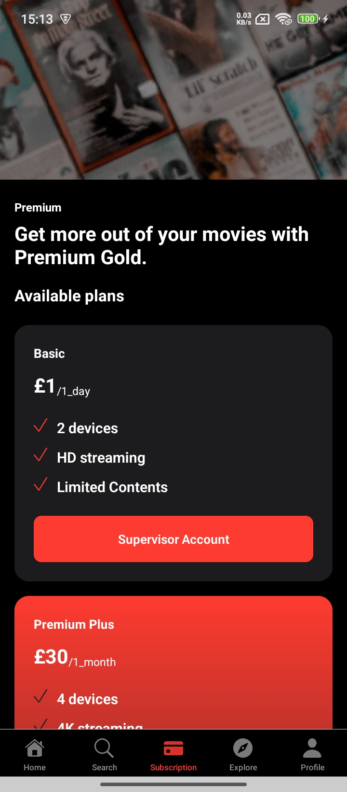
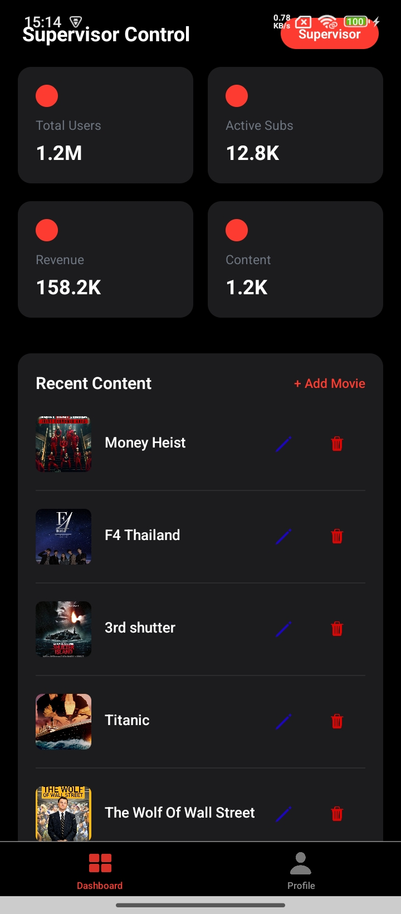

# Movie Explorer+

Movie Explorer+ is a modern mobile application built with React Native, designed for exploring, searching, and managing a movie database. The app features a beautiful black and red theme, delivering a sleek user experience for both regular users and `supervisors/admins`.

## Table of Contents

- [Features](#features)
- [App Theme](#app-theme)
- [Tech Stack](#tech-stack)
- [Screens & Functionality](#screens--functionality)
- [Screenshots](#screenshots)
- [Getting Started](#getting-started)
- [Contribution Guidelines](#contribution-guidelines)
- [Acknowledgments](#acknowledgments)

---

## Features

- Splash screen with `data loading` and `authentication` check
- `Role-based` authentication (User, Supervisor/Admin)
- Secure session management using `AsyncStorage`
- `Bottom tab navigation` for users and supervisors
- Movie search by `title` or `genre`, with detailed results
- Movie subscription `plans`, integrated with `Stripe`
- Explore and browse movies with `pagination`
- Admin dashboard for `managing movie content` (add, edit, delete)
- Profile management for users and supervisors

---

## App Theme

- **Primary Colors:** Black (background), Red (accents, highlights)
- **Text:** White or light gray for visibility
- **Design:** Modern, clean, and cinematic

---

## Tech Stack

- **Framework:** React Native
- **Navigation:** React Navigation (Stack & Bottom Tabs)
- **State Management:** React Context / useState
- **Storage:** AsyncStorage (for tokens and sessions)
- **Payments:** Stripe Integration
- **Backend:** (Assumed REST API for movies/auth, please specify if needed)
- **Other:** Custom MovieCard component, role-based access logic

---

## Screens & Functionality

### 1. Splash Screen

- Displays while fetching user data, token, and preparing authentication state.

### 2. Authentication

- **Sign In / Sign Up / Sign Out**
- Role-based login (User, Supervisor/Admin)
- Restricts supervisors to their own role; users cannot log in as supervisors/admins
- Token storage in AsyncStorage for session management

### 3. User Experience (Bottom Tabs)

- **Home:** View top-rated, latest movies, and a "Continue Watching" section (not a streaming platform).
- **Search:** Search movies by title or genre. Search type and query passed to Result screen, with results displayed using MovieCard component.
- **Subscription:** View and purchase subscription plans, integrated with Stripe.
- **Explore:** Browse all movies with pagination.
- **Profile:** View personal info (name, email, phone, active membership).

### 4. Supervisor/Admin Experience (Bottom Tabs)

- **Admin:** Manage movies (add, edit, delete), dashboard (currently hardcoded), with pagination for large lists.
- **Profile:** View supervisor/admin information.

---

## Screenshots

>
> - Splash Screen
> <table>
> <tr>
>    <td></td>
> </tr>
> </table>
> - Authentication (Sign In/Sign Up)
> <table>
> <tr>
>    <td></td>
>    <td></td>
> </tr>
> </table>

> - Home, Search, Explore, Subscription, Profile
> <table>
> <tr>
>    <td></td>
>    <td></td>
>    <td></td>
>    <td></td>
>    <td></td>
> </tr>
> </table>
> - Admin Dashboard (for supervisors)
> <table>
> <tr>
>    <td></td>
> </table>

---

## Getting Started

1. **Clone the repository:**

   ```bash
   git clone https://github.com/YOUR_USERNAME/movie-explorer-plus.git
   cd movie-explorer-plus
   ```

2. **Install dependencies:**

   ```bash
   npm install
   # or
   yarn install
   ```

3. **Set up environment variables:**

   - Add your API endpoints, Stripe keys, etc. to an `.env` file.

4. **Run the app:**

   ```bash
   npx react-native run-android
   # or
   npx react-native run-ios
   ```

5. **Backend:**
   - Make sure your backend API for movies/auth is running and accessible.

---

## Contribution Guidelines

- Fork the repo and create your own feature branch.
- Commit your changes and push to your fork.
- Submit a pull request with a detailed description.
- For major changes, please open an issue first to discuss what you’d like to change.

---

## Acknowledgments

- [React Native](https://reactnative.dev/)
- [Stripe](https://stripe.com/)
- [React Navigation](https://reactnavigation.org/)
- Movie poster/icon resources as per your usage rights.
- Special thanks to contributors and testers.

---

> _Movie Explorer+ — Explore your next favorite film, anywhere!_
